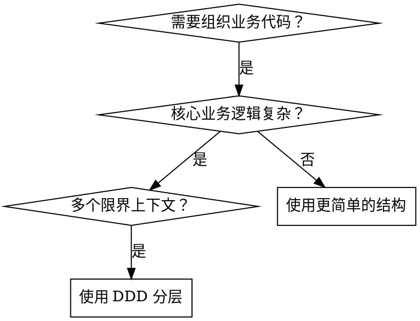

# DDD 四层架构

## 概述

领域驱动设计（DDD）四层架构通过关注点分离组织代码：接口层处理外部通信，应用层编排业务流程，领域层包含核心业务逻辑，基础设施层提供技术能力。

## 何时使用



**适用于：**
- 业务逻辑复杂且以领域为核心
- 存在多个限界上下文（如支付、订单、用户管理）
- 需要识别实体、值对象、聚合
- 需要业务代码与技术代码清晰分离

**不适用于：**
- 简单的 CRUD 应用
- 没有清晰的领域模型
- 单一限界上下文且业务逻辑简单

## 四层结构

| 层级 | 职责 | 示例内容 |
|------|------|----------|
| **interfaces 接口层** | 外部通信 | Controllers、DTOs、Filters、Interceptors、Assemblers |
| **application 应用层** | 业务编排 | 事件处理器、队列、任务、批处理、异步处理 |
| **domain 领域层** | 核心业务逻辑 | 领域服务、业务规则、充血模型 |
| **infrastructure 基础设施层** | 技术能力 | 仓储、外部 API、配置、工具类 |

## 识别 DDD 核心概念

### Entity（实体）
- **有身份标识**：拥有唯一 ID 区分
- **有生命周期**：创建、修改、删除
- **位置**：`infrastructure/repository/aggregate/`
- **示例**：`OrderEntity.java` 包含 `orderId` 字段

```java
// 实体：有 ID，可变生命周期
public class OrderEntity {
    private Long orderId;  // 身份标识
    private OrderStatus status;
    private List<OrderItem> items;
    // ... 业务方法
}
```

### Value Object（值对象）
- **无身份标识**：通过属性定义，不是 ID
- **不可变性**：创建后值不变
- **位置**：`infrastructure/repository/aggregate/`
- **不能独立持久化**：始终是实体的一部分
- **示例**：`AddressVO.java` 包含 street、city、zipCode

```java
// 值对象：无 ID，不可变
public class AddressVO {
    private final String street;
    private final String city;
    private final String zipCode;
    // 无 ID 字段，无独立生命周期
}
```

### Aggregate Root（聚合根）
- **入口点**：访问内部对象的唯一途径
- **一致性边界**：维护业务不变量
- **有 ID**：作为根的实体
- **位置**：`infrastructure/repository/aggregate/`
- **示例**：`OrderEntity` 作为根，包含 `OrderItem` 实体

```java
// 聚合根
public class OrderEntity {
    private Long orderId;  // 根的身份标识

    // 只能通过根访问 - 永远不要直接加载 OrderItem
    public void addItem(OrderItem item) {
        // 维护业务不变量
        if (status == OrderStatus.CANCELLED) {
            throw new IllegalStateException("已取消的订单不能添加商品");
        }
        items.add(item);
    }
}
```

### Aggregate（聚合）
- **对象集群**：实体 + 值对象 + 实体
- **作为一个单元处理**：一起保存/加载
- **单一根**：每个聚合只有一个聚合根

```
订单聚合：
├── OrderEntity (聚合根 - 有 ID)
│   ├── AddressVO (值对象 - 无 ID)
│   ├── OrderItem (实体 - 聚合内有 ID)
│   └── PaymentInfoVO (值对象 - 无 ID)
```

### Domain Service（领域服务）
- **无状态的业务逻辑**：不属于某个实体的业务规则
- **领域核心**：包含领域内的业务计算和规则
- **位置**：`domain/*/`
- **何时使用**：业务逻辑涉及多个聚合、或是无状态的操作

```java
// 领域服务：处理跨聚合或无状态的业务逻辑
@Service
public class OrderDomainService {
    private ProductRepository productRepository;
    private CustomerRepository customerRepository;

    // 跨聚合的业务逻辑
    public void validateOrder(OrderEntity order) {
        // 检查客户状态（跨聚合）
        Customer customer = customerRepository.findById(order.getCustomerId());
        if (!customer.isActive()) {
            throw new BusinessException("客户账户已冻结");
        }

        // 检查商品库存（跨聚合）
        for (OrderItem item : order.getItems()) {
            Product product = productRepository.findById(item.getProductId());
            if (product.getStock() < item.getQuantity()) {
                throw new BusinessException("商品库存不足");
            }
        }
    }

    // 复杂的业务计算
    public Money calculateDiscount(OrderEntity order, CustomerLevel level) {
        // 领域核心的计算逻辑
        // ...
    }
}
```

### Application Service（应用服务）
- **业务编排**：协调领域对象完成用例
- **无业务逻辑**：只负责流程编排，不包含业务规则
- **事务边界**：管理事务的开启和提交
- **位置**：`application/*/`
- **职责**：调用领域服务、仓储、发布事件等

```java
// 应用服务：用例编排，不包含业务逻辑
@Service
public class OrderAppService {
    private OrderDomainService orderDomainService;
    private OrderRepository orderRepository;
    private PaymentDomainService paymentDomainService;
    private EventPublisher eventPublisher;

    @Transactional
    public OrderResponse createOrder(OrderRequest request) {
        // 1. 组装领域对象（仅数据转换，无业务逻辑）
        OrderEntity order = assembler.toEntity(request);

        // 2. 调用领域服务执行业务验证
        orderDomainService.validateOrder(order);

        // 3. 调用领域服务计算金额
        Money discount = orderDomainService.calculateDiscount(order, request.getCustomerLevel());
        order.applyDiscount(discount);

        // 4. 持久化（基础设施）
        orderRepository.save(order);

        // 5. 发布领域事件（基础设施）
        eventPublisher.publish(new OrderCreatedEvent(order.getId()));

        // 6. 转换返回（仅数据转换）
        return assembler.toResponse(order);
    }
}
```

### 领域服务 vs 应用服务

| 对比维度 | 领域服务 | 应用服务 |
|----------|----------|----------|
| **职责** | 核心业务逻辑和规则 | 用例编排和流程控制 |
| **业务规则** | 包含业务规则 | 不包含业务规则 |
| **状态** | 无状态 | 无状态 |
| **依赖方向** | 被应用服务调用 | 调用领域服务 |
| **示例** | 订单校验、折扣计算、库存扣减 | 创建订单、支付流程、用户注册流程 |

### Repository（仓储）
- **定义**：管理聚合根集合的接口，封装数据访问
- **位置**：接口在 `domain` 包，实现在 `infrastructure` 包
- **职责**：提供聚合根的增删改查，不包含业务逻辑
- **特点**：只操作聚合根，不直接操作聚合内部对象

```java
// 1. 领域层定义仓储接口
package cn.com.xxxx.domain.order;

public interface OrderRepository {
    // 保存聚合根（包含所有内部对象）
    void save(OrderEntity order);

    // 根据 ID 查找聚合根
    OrderEntity findById(Long orderId);

    // 根据业务条件查找
    List<OrderEntity> findByCustomerId(Long customerId);

    // 删除聚合根
    void delete(Long orderId);
}
```

```java
// 2. 基础设施层实现仓储
package cn.com.xxxx.infrastructure.repository;

@Repository
public class OrderRepositoryImpl implements OrderRepository {

    @Autowired
    private OrderMapper orderMapper;  // MyBatis/JPA 等

    @Override
    public void save(OrderEntity order) {
        // 持久化聚合根及其所有内部对象
        orderMapper.insert(order);
        // 级联保存 OrderItem、AddressVO 等
    }

    @Override
    public OrderEntity findById(Long orderId) {
        // 加载整个聚合
        OrderEntity order = orderMapper.selectById(orderId);
        // 级联加载 OrderItem、AddressVO 等
        return order;
    }

    @Override
    public List<OrderEntity> findByCustomerId(Long customerId) {
        return orderMapper.selectByCustomerId(customerId);
    }

    @Override
    public void delete(Long orderId) {
        orderMapper.deleteById(orderId);
    }
}
```

### Domain Event（领域事件）
- **定义**：领域内已发生的事实，表示状态变更
- **位置**：`domain/*/event/`
- **用途**：解耦聚合，实现最终一致性，触发副作用
- **命名**：过去式，如 `OrderCreatedEvent`、`PaymentCompletedEvent`

```java
// 1. 定义领域事件
package cn.com.xxxx.domain.order.event;

public class OrderCreatedEvent {
    private final Long orderId;
    private final Long customerId;
    private final Money totalAmount;
    private final LocalDateTime occurredOn;

    public OrderCreatedEvent(Long orderId, Long customerId, Money totalAmount) {
        this.orderId = orderId;
        this.customerId = customerId;
        this.totalAmount = totalAmount;
        this.occurredOn = LocalDateTime.now();
    }

    // getters...
}
```

```java
// 2. 聚合根发布事件
package cn.com.xxxx.domain.order;

@Entity
public class OrderEntity {
    private List<DomainEvent> domainEvents = new ArrayList<>();

    public void complete() {
        this.status = OrderStatus.COMPLETED;
        // 记录领域事件
        domainEvents.add(new OrderCompletedEvent(this.orderId));
    }

    public void clearDomainEvents() {
        domainEvents.clear();
    }

    public List<DomainEvent> getDomainEvents() {
        return Collections.unmodifiableList(domainEvents);
    }
}
```

```java
// 3. 应用服务发布事件到基础设施
package cn.com.xxxx.application.order;

@Service
public class OrderAppService {
    private OrderRepository orderRepository;
    private EventPublisher eventPublisher;  // 基础设施层

    @Transactional
    public void completeOrder(Long orderId) {
        // 1. 加载聚合根
        OrderEntity order = orderRepository.findById(orderId);

        // 2. 执行业务操作（会产生领域事件）
        order.complete();

        // 3. 持久化
        orderRepository.save(order);

        // 4. 发布领域事件（消息队列/事件总线）
        for (DomainEvent event : order.getDomainEvents()) {
            eventPublisher.publish(event);
        }
        order.clearDomainEvents();
    }
}
```

```java
// 4. 基础设施层事件发布
package cn.com.xxxx.infrastructure.event;

@Component
public class EventPublisher {
    @Autowired
    private RabbitTemplate rabbitTemplate;

    public void publish(DomainEvent event) {
        if (event instanceof OrderCreatedEvent) {
            rabbitTemplate.convertAndSend("order.created", event);
        } else if (event instanceof PaymentCompletedEvent) {
            rabbitTemplate.convertAndSend("payment.completed", event);
        }
    }
}
```

```java
// 5. 其他限界上下文订阅事件
package cn.com.xxxx.application.notification;

@Component
public class NotificationEventHandler {

    @RabbitListener(queues = "order.created")
    public void handleOrderCreated(OrderCreatedEvent event) {
        // 发送通知
        notificationService.sendOrderCreatedNotification(event.getCustomerId());
    }
}
```

### 领域事件 vs 应用事件

| 对比维度 | 领域事件 | 应用事件 |
|----------|----------|----------|
| **定义位置** | 领域层 | 应用层或基础设施层 |
| **业务含义** | 表示领域内的重要状态变更 | 表示技术层面的操作 |
| **示例** | OrderCreated、PaymentCompleted | RequestReceived、CacheInvalidated |
| **订阅者** | 其他限界上下文 | 内部技术组件 |

### Bounded Context（限界上下文）
- **定义**：系统的业务边界，同一概念在不同上下文有不同含义
- **实现方式**：使用 Java 包分离，每个限界上下文有独立的四层架构
- **核心原则**：不同限界上下文之间通过 API 或领域事件通信

```
cn.com.xxxx
├── sales                    // 销售上下文
│   |-- interfaces
│   |-- application
│   |-- domain
│   │   └-- order           // 这里的 Order 是销售订单
│   └-- infrastructure
│
├── logistics                 // 物流上下文
│   |-- interfaces
│   |-- application
│   |-- domain
│   │   └-- order           // 这里的 Order 是物流订单（运单）
│   └-- infrastructure
│
├── payment                   // 支付上下文
│   |-- interfaces
│   |-- application
│   |-- domain
│   │   └-- order           // 这里的 Order 是支付订单
│   └-- infrastructure
│
└── shared                    // 共享内核（可选）
    |-- common               // 通用工具类
    └-- types                // 共享值对象（如 Money、Address）
```

**限界上下文之间的关系：**

| 关系类型 | 说明 | 示例 |
|----------|------|------|
| **Shared Kernel（共享内核）** | 共享部分模型和代码 | `Money`、`Address` 等通用值对象 |
| **Customer/Supplier（客户/供应商）** | 上游提供服务给下游 | 销售上下文调用支付上下文 |
| **ACL（防腐层）** | 隔离外部模型，保护内部领域 | 调用第三方 API 时进行转换 |
| **OHS（开放主机服务）** | 通过公开 API 提供服务 | 支付上下文暴露 HTTP API |

## 项目结构参考

```
cn.com.xxxx
|-- interfaces              // 1. 接口层：REST、gRPC、过滤器
|   |-- controller          // API 端点
|   |   |-- authen/dto      // 请求/响应 DTO
|   |   |   |-- authRequest.java
|   |   |   |-- authResponse.java
|   |   |-- AuthenController.java
|   |-- assembler           // DTO ↔ VO/BO/Entity 转换
|   |-- expo                // Expo 接口
|   |-- grpc                // gRPC 接口
|   |-- filter              // 全局过滤器 (OncePerRequestFilter)
|   |-- interceptor         // 条件拦截器
|   |-- advice              // 异常处理器
|
|-- application             // 2. 应用层：业务编排（非业务逻辑）
|   |-- buyapp              // 示例：购买应用服务
|   |   |-- event
|   |   |   |-- before      // 购买前置事件
|   |   |   |-- after       // 购买后置事件
|   |   |-- queue           // 队列（生产/消费模型）
|   |   |   |-- assembler   // VO ↔ Entity 转换
|   |   |-- task            // 定时任务
|   |   |-- batch           // 批处理
|   |   |-- async           // 异步处理
|
|-- domain                  // 3. 领域层：核心业务逻辑（充血模型）
|   |-- buy                 // 购买领域服务
|   |   |-- OrderService.java
|   |-- pay                 // 支付领域服务
|   |   |-- channel
|   |   |   |-- AbstractPay.java
|   |   |   |-- Alipay.java
|   |   |   |-- WechatPay.java
|   |   |-- PayChannelInterface.java
|
|-- infrastructure         // 4. 基础设施层：仓储、外部 API、工具
    |-- configuration       // Spring 配置
    |-- exceptions          // 自定义异常
    |-- util                // 工具类
    |   |-- StringUtils.java
    |-- repository          // 仓储层
    |   |-- aggregate
    |   |   |-- OrderEntity.java      // 聚合根（有 ID）
    |   |   |-- AddressVO.java        // 值对象（无 ID）
    |   |   |-- OrderItem.java        // 实体（聚合内有 ID）
    |   |   |-- OrderStatusEnum.java  // 枚举
    |   |-- OrderRepository.java
    |-- api                 // 外部 API
        |-- openfeign
        |-- grpc
```

## 快速参考：归属位置

| 组件 | 位置 | 关键标识 |
|------|------|----------|
| **Controller 控制器** | `interfaces/controller/` | 暴露 `@RestController` |
| **DTO 数据传输对象** | `interfaces/controller/*/dto/` | 请求/响应对象 |
| **Assembler 汇编器** | `interfaces/assembler/` 或 `application/*/queue/assembler/` | DTO ↔ VO/Entity 转换 |
| **Domain Service 领域服务** | `domain/*/` | 业务逻辑、充血模型 |
| **Aggregate Root 聚合根** | `infrastructure/repository/aggregate/` | 有 ID 的实体，入口点 |
| **Value Object 值对象** | `infrastructure/repository/aggregate/` | 无 ID，不可变 |
| **Repository 仓储** | `infrastructure/repository/` | 数据访问接口 |
| **External API 外部 API** | `infrastructure/api/` | Feign/gRPC 客户端 |

## 常见错误

| 错误 | 为什么错 | 修正 |
|------|----------|------|
| **Controller 中写业务逻辑** | 违反分离原则，难以测试 | 移到领域服务 |
| **应用服务中包含业务规则** | 混淆编排与业务逻辑 | 业务规则移到领域服务 |
| **仓储中的实体没有 ID** | 值对象没有独立生命周期 | 嵌入实体或作为 VO 使用 |
| **直接访问聚合内部对象** | 绕过一致性边界 | 始终通过聚合根访问 |
| **基础设施层反向调用上层** | 违反单向依赖原则 | 使用依赖倒置，领域层定义接口 |
| **接口层直接调用基础设施层** | interfaces → infrastructure 禁止 | 通过 application 或 domain 层访问 |
| **领域层使用 DTO** | 泄露接口层关注点 | 内部使用 VO |
| **贫血领域模型** | 业务逻辑分散 | 充血模型，包含行为 |

## 层级依赖规则

```
interfaces ──────────────> application ──────────────> domain ──────────────> infrastructure
     │                           │                              │                          │
     │                           ──────────────────────────────>                          │
     │                                                         │                          │
     ─────────────────────────────>                           │                          │
     │                                                         │                          │
     X (禁止)                                                 ───────────────────────────>
```

**基本依赖原则：只能向下调用，不能反向调用**

| 调用方向 | 是否允许 | 说明 |
|----------|----------|------|
| interfaces → application | ✅ 允许 | 接口层调用应用层（标准路径） |
| interfaces → domain | ✅ 允许 | 跨层调用，接口层直接调用领域层（如简单查询场景） |
| interfaces → infrastructure | ❌ 禁止 | 接口层不应直接访问基础设施层 |
| application → domain | ✅ 允许 | 应用层调用领域层（标准路径） |
| application → infrastructure | ✅ 允许 | 应用层直接调用基础设施层（如仓储、缓存） |
| domain → infrastructure | ✅ 允许 | 领域层调用基础设施层（标准路径） |
| **任何反向调用** | ❌ 禁止 | infrastructure 不能调用上层 |

**依赖倒置实现：**
- 领域层定义接口（如 `OrderRepository` 接口在 `domain` 包）
- 基础设施层实现接口（如 `OrderRepositoryImpl` 在 `infrastructure` 包）
- 调用时依赖的是接口（domain 层定义），实现在 infrastructure 层

**示例：**

```java
// application → infrastructure（允许）
@Service
public class OrderAppService {
    private OrderRepository repository;  // 仓储在 infrastructure 层
    private CacheManager cache;          // 缓存在 infrastructure 层
}

// interfaces → domain（允许，如简单查询场景）
@RestController
public class OrderController {
    private OrderQueryService;  // 领域查询服务
    @GetMapping("/orders/{id}")
    public OrderVO getOrder(@PathVariable Long id) {
        return orderQueryService.findById(id);  // 直接调用领域层
    }
}

// interfaces → infrastructure（禁止，这是错误示例）
@RestController
public class OrderController {
    private OrderRepository repository;  // ❌ 接口层不应直接依赖基础设施层
}
```

## 实现模式

**示例：创建新订单功能**

1. **interfaces**：`OrderController` 接收 `OrderRequest` DTO
2. **application**：`OrderAppService` 编排工作流
3. **domain**：`OrderDomainService` 包含业务规则
4. **infrastructure**：`OrderRepository` 持久化 `OrderEntity` 聚合根

```java
// 1. 接口层
@RestController
public class OrderController {
    private OrderAppService appService;

    @PostMapping("/orders")
    public OrderResponse createOrder(@RequestBody OrderRequest request) {
        return appService.createOrder(request);
    }
}

// 2. 应用层
@Service
public class OrderAppService {
    private OrderDomainService domainService;
    private OrderRepository repository;

    public OrderResponse createOrder(OrderRequest request) {
        // 仅编排 - 不包含业务规则
        OrderVO orderVO = assembler.toVO(request);
        OrderEntity order = domainService.createOrder(orderVO);
        repository.save(order);
        return assembler.toResponse(order);
    }
}

// 3. 领域层
@Service
public class OrderDomainService {
    // 核心业务逻辑在此
    public OrderEntity createOrder(OrderVO vo) {
        // 业务验证、不变量检查
        OrderEntity order = new OrderEntity();
        order.applyBusinessRules(vo);
        return order;
    }
}

// 4. 基础设施层
@Repository
public class OrderRepository {
    public void save(OrderEntity order) {
        // 持久化聚合根及其所有内部对象
    }
}
```

## 实际收益

使用 DDD 四层架构：
- **清晰分离**：业务逻辑与技术关注点隔离
- **可测试性**：无需基础设施即可测试领域逻辑
- **可维护性**：某一层的变更不会级联
- **可扩展性**：限界上下文独立演进
